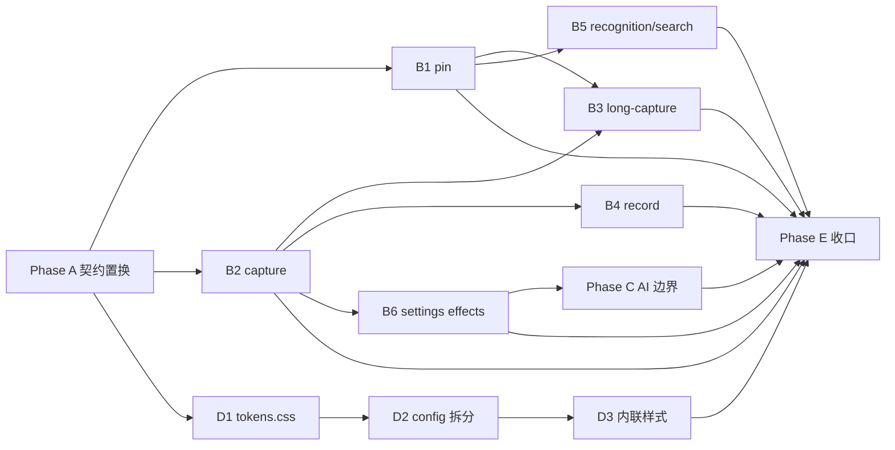

# v2.3 架构减负与可维护性路线图

- 日期：2026-09-10
- 基线：`master` @ `dc3829c`（v2.2.4 构建验收后）
- 跨度：约 4–8 周，目标形成下一稳定版（v2.3）
- 主线：**架构减负与可维护性**（性能 / 新功能 / 发布工程见附录）
- 性质：规划文档，不改业务代码；实施时应拆为独立 PR

---

## 1. 架构现状快照

### 1.1 进程与模块拓扑

```text
Electron main (main.js 3583 行 / 142 KB)
├── bootstrap     data-root* · e2e · crashReporter · logger · diagnostics · perf
├── settings      electron-store + SettingsService + CredentialStore (safeStorage)
├── history       HistoryService（sharp 缩略图 + 索引）
├── AI            deepseek.js(根) + ai-providers/adapters/capabilities/feature-router
├── OCR           OcrService → HighlighterOcrSidecar.exe + ppocr-v4-ch ONNX
├── Search        EverythingService → Everything.exe / Rust sidecar（含 E2E 假服务）
├── Record        RecordingService → ffmpeg-static
├── Capture       screenshot-desktop + SmartSelect.exe + LongCaptureSession
└── Selection     SelectionHookService + SelectionWindowManager + ToolbarStreamSession

Renderer 窗口（ipc-security IPC_SURFACES 角色）:
  config · toolbar · action · capture · long-capture(+overlay) · pin ·
  recognition · search · record · record-frame

原生 / 外部:
  smart-select (C#/UIA) · ocr sidecar (Rust+ORT 26MB) · everything-search (Rust)
  · Everything.exe 兜底 · sharp · ffmpeg-static · selection-hook
```

| 层 | 技术选型 | 结论 |
|---|---|---|
| 主进程编排 | 单文件 `main.js` + 薄 `main/ipc/*` + 服务层 | 服务层成熟，编排层未模块化 |
| 渲染层 | 原生 JS + CommonJS，无打包器/框架 | 启动快、依赖少；跨窗共享靠 `<script src>` |
| 安全 | contextIsolation + sandbox + 角色白名单 IPC | 成熟，应作为重构红线 |
| 质量 | 77 单测文件 + c8 门禁 + Playwright E2E | 覆盖率门禁强，但 147 处 `assert.match(main.js,…)` 锁死拆分 |

### 1.2 值得保留的资产（重构红线）

1. **IPC 安全模型**：`ipc-security.js` 角色白名单 + `authorizeIpcRole` 所有权 + `window-security` 强制 webPreferences。任何拆分不得绕过 `assertComplete()`。
2. **服务层依赖注入**：OCR / Everything / Recording 等已支持注入 spawn/timer/fs，覆盖率门禁按文件分级（85%/60%/90%）。
3. **数据目录迁移纪律**：quiesce writers、rollback、provisional root。
4. **可观测性**：脱敏日志、`performance` 事件、诊断包导出（默认离线）。
5. **E2E 接缝**：`e2e-bootstrap` + `HIGHLIGHTER_E2E_FAKE_EVERYTHING` 假服务，生产路径零影响。

---

## 2. 架构痛点（按优先级）

### P1 — `main.js` 上帝对象

| 证据 | 数值 |
|---|---|
| 行数 | 3583（2.1 冻结时 2922，仍持续膨胀） |
| 体积 | 142 KB |
| 模块级可变单例 | ~30（`mainWindow`、`currentCaptureWindow`、`pinWindows`、`recordingService`…） |
| 源码文本断言 | 147 处 `assert.match(main.js, …)`，分布在 18 个测试文件 |

职责混杂窗口工厂、命令总线 `executeFunction`、SmartSelect 会话、截图/长截图/录屏/贴图编排、settings 副作用扇出、生命周期。

**风险**：任何新功能默认落在 main.js；并行开发冲突面大；审查成本线性上升。

### P2 — IPC / 控制器模块化不完整

`main/ipc/*` 目前多为「薄注册器」，真正的控制器仍内联在 main.js：

- pin handlers（约 2968–3100+）
- capture / recording 控制器
- settings 副作用扇出（约 2346–2372：快捷键、托盘、游戏模式、OCR、更新、主题、搜索、划词钩子一次全刷）

已模块化的反例（应作为拆分模板）：`selection-window-manager`、`toolbar-stream-session`、`shortcut-service`。

### P3 — 设置改动的副作用扇出

一次 `settings:update` 在 main.js 内联触发 8+ 个子系统。无契约测试覆盖「哪一字段影响哪一子系统」，回归靠人工。

### P4 — AI 边界割裂

`deepseek.js`（根，~533 行）与 `main/services/ai-{providers,protocol-adapters,feature-router,model-capabilities}` 职责重叠：客户端/协议/配置不在同一边界。新供应商或协议改动需跨 3 处。

### P5 — 渲染层无共享设计系统

| 现象 | 证据 |
|---|---|
| `config.js` 单体 | 110 KB / ~1575 行，全部设置路由 |
| 设计令牌重复 | `--primary:#1677ff` 等在 capture/config/search/record CSS 各写一份 |
| 内联样式 | pin/action 整页 `<style>` 嵌在 HTML；capture.html 23 处 `style="--icon:…"` |
| 无打包器 | 跨窗共享靠相对路径 `<script src>`，无组件复用 |

**权衡**：引入 React/Vue 不在本主线价值内。v2.3 只做 **CSS token 文件 + 设置页路由拆分**，不引入框架。

### P6 — 测试与源码文本强耦合

147 处对 `main.js` 源码字符串的断言使「移动代码 = 改测试」。这是 P1 拆分的最大阻力，必须在拆分前先建立 **行为契约测试**（IPC 形状、服务调用顺序），逐步替换文本断言。

---

## 3. v2.3 目标与非目标

### 3.1 目标（用户可见行为不变）

1. `main.js` 降到 **≤ 2000 行**，职责收敛为：生命周期 + 服务装配 + 命令路由。
2. 每个功能域拥有 **独立模块**（窗口工厂 + 控制器 + IPC 注册），`main/ipc/*` 从薄注册器升级为完整域模块。
3. settings 副作用变为 **声明式订阅表**，字段 → 子系统映射可测。
4. AI 层收敛为单一 `main/services/ai/` 边界，`deepseek.js` 退役或变为薄适配。
5. 新增 `assets/styles/tokens.css`（或 `shared/tokens.css`），至少 capture / config / search / record 四窗引用同一份令牌。
6. `config.js` 按路由拆为 `config/routes/*.js`，主文件只做壳与导航。

### 3.2 非目标（本版不做）

- 不改 IPC 通道名、返回形状、preload 桥接口（除显式废弃并双轨过渡）。
- 不引入前端框架或打包器（bundler）。
- 不做跨平台、录屏音频、云同步。
- 不做长截图匹配算法优化（语料未到位，见附录）。
- 不把性能优化混入重构提交（2.1 纪律延续：**重构提交不得混入产品行为变化**）。

### 3.3 成功标准（发布门禁）

| 门禁 | 判定 |
|---|---|
| `npm run check` | 全绿 |
| `npm test` + `test:long-capture` | 全绿 |
| `test:coverage:*` | 门禁不降级 |
| Playwright E2E | bootstrap + local-search 全绿 |
| `main.js` 行数 | ≤ 2000 |
| IPC `assertComplete()` | 仍通过；无新增未登记通道 |
| 源码文本断言 | ≤ 80（从 147 降约 45%），且不再新增 |
| 实机 smoke | 截图→标注→OCR→贴图、划词工具栏、本地搜索、历史 |

---

## 4. 分阶段实施计划

> 原则：每阶段可独立合并；行为等价；测试同步；不与功能/性能混提交。

### Phase A — 契约测试置换（第 1–2 周，前置）

**目的**：拆除对 `main.js` 文本的硬依赖，为 Phase B 腾挪空间。

| 任务 | 验收 |
|---|---|
| A1 盘点 147 处文本断言，按域分组（capture/pin/record/settings/ai/shortcut…） | 清单表：文件:行 → 断言意图 → 可替换的行为契约 |
| A2 为高频域写行为契约：IPC 形状快照 + 服务调用 spy（注入 fake service） | 新契约测试文件；对应文本断言删除或降级 |
| A3 将可移到独立模块的纯函数（命名、几何、URL 校验委托）抽出，同步把文本断言改为对新模块的断言 | 源码断言数 ≤ 100；`npm test` 绿 |

**依赖**：无。**风险**：低。**产出**：断言迁移手册 + 约 50 行的文本断言删除。

### Phase B — 主进程域模块拆分（第 2–5 周，核心）

**模板**（与既有 `selection-window-manager` 一致）：

```text
main/domains/<domain>/
  windows.js      # BrowserWindow 工厂
  controller.js   # 业务编排，不直接 require electron ipcMain
  ipc.js          # 注册通道，调用 controller
  index.js        # 对 main.js 导出 createXxx({ deps })
```

| 顺序 | 域 | 从 main.js 迁出 | 验收 |
|---|---|---|---|
| B1 | **pin** | 贴图窗口工厂 + handlers + 清理 | pin 创建/置顶/穿透/关闭行为不变；`pin-ipc` 契约绿 |
| B2 | **capture** | 桌面源、截图窗口、保存、SmartSelect 会话 | `capture.interactive` 埋点字段不变；截图 smoke 通过 |
| B3 | **long-capture** | 会话编排 + overlay 窗口 | `tests/long-capture.test.js` 全绿 |
| B4 | **record** | 录制窗口 + RecordingService 编排 | 录制 smoke：起停、预览、导出 MP4 |
| B5 | **recognition / search 窗口** | 窗口创建与生命周期 | local-search E2E 绿 |
| B6 | **settings 副作用** | 声明式 `settingsEffects` 表：`{ field, effect }` 注册 | 单测覆盖「改 theme 只调用 X」「改 shortcut 只调用 Y」 |
| **B0（贯穿）** | main.js 保留 | `startApplication`、服务装配、`executeFunction` 路由表 | 行数按阶段递减，最终 ≤ 2000 |

**约束**：

- `DEFAULT_SETTINGS` 仍从 main.js 或 `main/settings/defaults.js` 单一导出，`settings-validation.js` 模板不断裂。
- 新域模块 **必须** 在 `ipc-security.js` 保持既有角色/通道，不扩权。
- 每个 B* 一个 PR，附带：删除对应源码文本断言 + 新契约测试 + 实机 smoke 记录。

### Phase C — AI 边界收敛（第 4–6 周，可与 B 并行后半）

| 任务 | 验收 |
|---|---|
| C1 将 `deepseek.js` 逻辑并入 `main/services/ai/`，根文件改为转发或删除 | 无生产代码引用根路径；供应商测试绿 |
| C2 协议适配器单一入口 `resolveProtocolAdapter(settings)` | 新增协议只改 `ai/` 目录 |
| C3 划词 / 翻译 / 截图 OCR 翻译 三条 AI 路径共享同一 router | `ai-feature-router` 测试扩展；行为不变 |

### Phase D — 渲染层最小共享层（第 5–7 周，可穿插）

| 任务 | 验收 |
|---|---|
| D1 抽出 `shared/tokens.css`（颜色、圆角、阴影、间距、focus ring） | capture/config/search/record 改为 `@import` 或 link；computed style 对比无回归 |
| D2 `config.js` 按侧栏路由拆 `config/routes/{home,ai,history,search,models,hotkeys,update,diagnostics}.js` | 每个路由文件 ≤ 300 行；主文件 ≤ 400 行；设置页 E2E/smoke 通过 |
| D3 pin / action 的内联 `<style>` 迁出为外部 CSS | CSP 与视觉验收不变 |

**明确不做**：React/Vue、CSS Modules、打包器。

### Phase E — 收口与发布准备（第 7–8 周）

| 任务 | 验收 |
|---|---|
| E1 行数/断言/覆盖率门禁写入 CI 或 `scripts/check-architecture.js` | PR 上可自动失败 |
| E2 全量实机验收（截图/OCR/长截图/录屏/贴图/划词/搜索/历史/更新检查） | 按 `docs/releases/` 惯例出记录 |
| E3 版本号、变更日志、`docs/releases/` 验收文档 | 与 2.2.4 文档结构一致 |

---

## 5. 任务依赖与里程碑



| 里程碑 | 时间点 | 出口条件 |
|---|---|---|
| M1 | 第 2 周末 | A 完成；断言 ≤ 100；契约测试覆盖 pin/capture/settings |
| M2 | 第 5 周末 | B1–B5 合并；main.js ≤ 2200；核心路径实机绿 |
| M3 | 第 7 周末 | B6+C+D 完成；main.js ≤ 2000；AI 单边界 |
| M4 | 第 8 周 | E 完成；v2.3 候选构建 + 验收文档 |

---

## 6. 风险与缓解

| 风险 | 影响 | 缓解 |
|---|---|---|
| 147 处文本断言漏改导致 CI 红 | 阻塞合并 | Phase A 先做；A1 清单作 checklist |
| 拆分引入隐蔽行为变化（时序/所有权） | 用户可见回归 | 每 PR 实机 smoke；IPC 契约快照；禁止混功能提交 |
| `DEFAULT_SETTINGS` / validation 模板断裂 | 设置页数据损坏 | defaults 单一导出点；`settings-validation` 测试扩展 |
| AI 迁移影响多供应商用户 | 划词/翻译失败 | C 阶段双轨：旧路径保留一个 minor 周期，日志埋点对比 |
| 并行域拆分冲突 | 合并冲突 | 按 B 顺序串行高耦合域；D 层与 B 可并行（无共享文件则安全） |
| 行数门禁「刷行数」（空行/重复） | 假达标 | 门禁同时看行数 + 该文件 require 的域模块数量 + 源码断言数 |

---

## 7. 附录：非本主线工作（进入后续版本）

以下内容已在仓库文档或实测中出现，**不进入 v2.3 主线**，避免与架构减负抢审查带宽。

### 7.1 性能（待语料/实机数据）

| 项 | 现状 | 阻塞 |
|---|---|---|
| 长截图水平匹配 86ms（门槛 50ms） | 算法冻结 | 真实语料未采集（工具已就绪，`docs/performance/2026-09-09-long-capture-corpus.md`） |
| History 全量异步 I/O | SSD 上 6–8ms，已后置 | 慢盘/失效路径场景补齐后再评估 |
| `appendPreview` 宽高比收窄 | 显示缺陷，O(n²) 已证伪 | 需产品决策修复方案 |
| 录屏真机 1080p/4K CPU/GPU A/B | 仅有 pacer 仿真 | 需实机矩阵 |
| 托盘闲置 Working Set −20~30% | 未闭环 | 需 controlled 冷启动测量 |

### 7.2 功能候选（文档中已出现）

- 录屏音轨（当前导出无音频）
- 本地搜索预览面板（一期只有列表）
- 长截图自动滚动（`native/scroll-driver` 曾回滚）
- AI 请求重试/退避（deferred plan）
- OCR 历史全文搜索（2.1 冻结时列为稳定后候选）
- 剪贴板兼容模式、AI 服务商抽象增强

### 7.3 发布工程

- 代码签名落地（`AZURE_TRUSTED_SIGNING_SETUP.md` 已存在但未跟踪入库）
- 硬件验收矩阵：Win10、100%/200% DPI、RDP、睡眠恢复（`HARDWARE_ACCEPTANCE.md`）
- 公开 Beta 的独立版本提交与不可覆盖 Release 资产纪律

---

## 8. 与既有文档的关系

| 文档 | 关系 |
|---|---|
| `docs/releases/2026-08-09-v2.1-scope-freeze.md` | 2.1 纪律（重构不混功能）延续到 v2.3 |
| `docs/plans/2026-09-09-ci-ocr-capture-dedup-design.md` §5.3 | 已明确「main.js 拆分需单独立项」——本路线图即该立项 |
| `docs/performance/2026-08-16-optimization-round.md` | 性能后置项进入附录 7.1，不阻塞本主线 |
| `docs/releases/2026-09-09-v2.2.4-build-acceptance.md` | 作为 v2.3 基线功能对照 |

---

## 9. 建议的第一批 PR（可立即开工）

1. **PR-A1**：文本断言盘点清单（docs + 测试注释），零行为变化。
2. **PR-A2**：`pin` 行为契约测试，替换 pin 相关 `assert.match(main.js, …)`。
3. **PR-B1**：`main/domains/pin/` 迁出（依赖 A2）。
4. **PR-D1**：`shared/tokens.css` + capture 窗引用（可与 A 并行）。

---

## 10. 开放决策（实施前需产品确认）

1. v2.3 版本号策略：`2.3.0` 正式 vs 先 `2.3.0-beta`（建议 beta，因重构面大）。
2. `deepseek.js` 是删除还是保留兼容转发一个版本周期。
3. 行数门禁是否进入 CI 强制，还是仅本地 `check-architecture` 建议值。
4. 源码文本断言目标 80 是否足够（或要求「新增文本断言禁止」的 CI 规则）。
